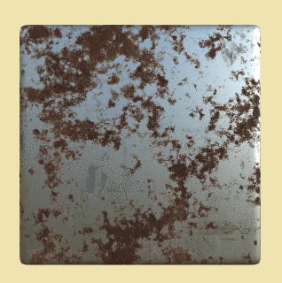

# Rust-and-Dirt-Removal-Simulation

The Rust and Dirt Removal simulation algorithm uses Edge detection to remove the background of the metalic object and  colour based image processing technique to detect and segment the region of metal covered by rust or dirt. Then a modified version of Averaging is used to replace the rust/dust pixels in the image.

